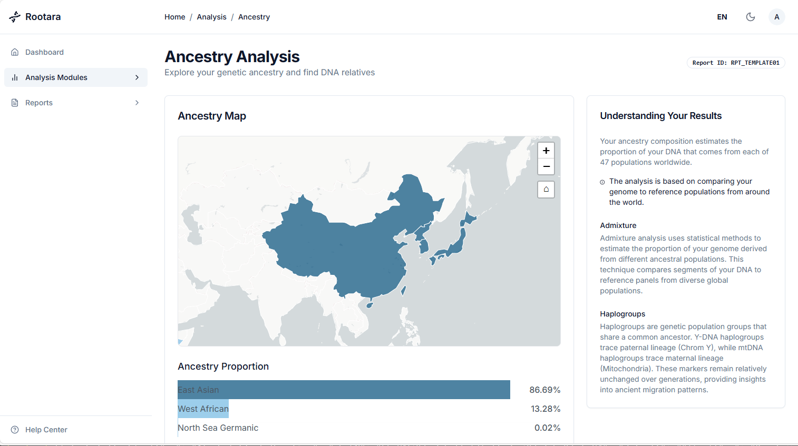
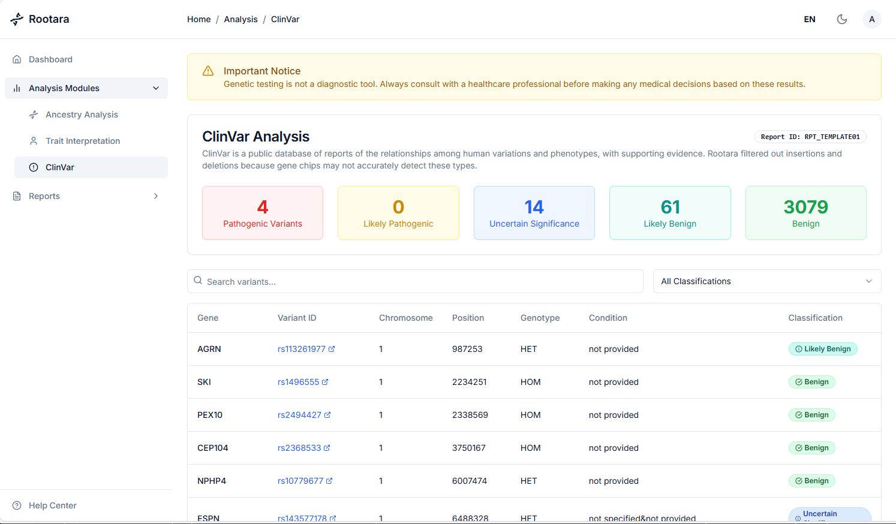

<div align="center">
  

  <h1>Rootara - Open Source Genetic Platform</h1>

  <p><strong>English | <a href="README_ZH.md">中文</a></strong></p>
</div>

## Introduction

Rootara is an easy-to-deploy consumer-grade genetic data hosting platform that users can self-deploy on their own servers to ensure data security. Rootara supports importing personal genetic data from testing service providers such as 23andMe and WeGene. Through quick installation and configuration using Docker Compose, users can safely perform various operations including ancestry analysis, genetic trait interpretation, and ClinVar database queries in their local environment.

## ⚠️ NOTICE

**The current system is in a testing phase, and all genetic trait analysis results are randomly generated test data with no scientific basis or reference value. Please do not use the test results for any medical, health-related, or other important decision-making purposes.**

## Features

### ✨ Core Functions
- 🧬 **Multi-source Compatibility**: Supports uploading genetic data files from 23andMe, WeGene, and other providers
- 📊 **Comprehensive Analysis**:
  - Ancestral origin exploration with interactive visualizations
  - Genetic trait assessment
  - Haplogroup analysis (paternal and maternal lineages)
  - ClinVar variant interpretation
- 🔒 **Privacy Protection**: All processing is completed locally, ensuring your personal information is not leaked

### 🚀 Performance & Reliability
- ⚡ **High Performance**: Redis caching improves API response speed by 70-90% (Standard version)
- 🔗 **Connection Pooling**: Database connection reuse improves resource utilization by 80%
- 📝 **Structured Logging**: Comprehensive logging system for easy troubleshooting
- 💊 **Health Monitoring**: Real-time system status and performance metrics monitoring

### 🛡️ Security Features
- 🔐 **JWT Authentication**: Secure user authentication mechanism
- 👤 **Non-root Containers**: Docker containers run with non-privileged users
- 🔑 **API Key Protection**: Encrypted frontend-backend communication
- 📊 **Resource Monitoring**: CPU, memory, disk usage monitoring with alerting

## Quick Start

### Choose Deployment Version

Select the appropriate deployment version based on your server configuration:

#### 📁 Standard Version (Recommended)
```bash
# Download configuration files
cd rootara/docker
# Start services
docker-compose -f docker-compose.standard.yml up -d
```

**Features:**
- Memory usage: ~70-80MB
- Performance: Includes Redis cache, API response speed improved by 70-90%
- Suitable for: Production environments, servers with sufficient memory (>1GB)

#### 📁 Lite Version
```bash
# Download configuration files
cd rootara/docker
# Start services
docker-compose -f docker-compose.lite.yml up -d
```

**Features:**
- Memory usage: ~30-40MB (saves 50MB)
- Performance: In-memory cache, slightly slower but sufficient

### System Requirements

#### Minimum Requirements
- **CPU**: 1 core
- **Memory**:
  - Standard version: 1GB RAM
  - Lite version: 512MB RAM
- **Storage**: 2GB available space
- **Software**: Docker 20.0+, Docker Compose 2.0+

#### Recommended Configuration
- **CPU**: 2 cores or more
- **Memory**: 2GB RAM or more
- **Storage**: 10GB available space (for data storage)

### Access System

After deployment, visit http://localhost:3000

**Default admin account:**
- Email: admin@rootara.app
- Password: rootara123

> 💡 **Recommendation**: Change the admin password immediately after first login

### Configuration

#### Required Configuration Changes

In your chosen `docker-compose.yml` file, it's recommended to modify:

```yaml
environment:
  # 🔧 Admin account configuration - Recommended to modify
  - ADMIN_EMAIL=your-email@example.com          # Admin email
  - ADMIN_PASSWORD=your-secure-password         # Admin password

  # 🔧 Security configuration - Recommended to modify
  - JWT_SECRET=your-random-secret-string        # JWT secret
  - ROOTARA_BACKEND_API_KEY=your-api-key        # API key (must match between frontend and backend)
```

#### Optional Configuration

```yaml
ports:
  - "3000:3000"  # 🔧 Port modification: change to 8080:3000 if needed

# Redis memory adjustment (Standard version only)
command: redis-server --appendonly yes --maxmemory 512mb --maxmemory-policy allkeys-lru
```

## User Guide

### Data Upload

1. After logging into the system, click "Upload Data"
2. Supported file formats:
   - 23andMe raw data files (.txt)
   - WeGene raw data files (.txt)

### Analysis Features

- **Ancestry Analysis**: View your ancestral geographical distribution



- **Haplogroup Analysis**: Paternal and maternal haplogroup analysis
- **Genetic Traits**: Understand the impact of genes on personal characteristics
- **Health Risks**: Variant interpretation based on the ClinVar database



## 🛠️ Common Commands

### Service Management
```bash
# Start services
docker-compose -f docker-compose.standard.yml up -d

# Stop services
docker-compose -f docker-compose.standard.yml down

# View logs
docker-compose -f docker-compose.standard.yml logs -f

# Restart services
docker-compose -f docker-compose.standard.yml restart

# Check service status
docker-compose -f docker-compose.standard.yml ps
```

### Data Management
```bash
# Backup data
cp -r ./data ./data-backup-$(date +%Y%m%d)

# View log files
tail -f ./logs/rootara.log
```

## 📊 Monitoring Endpoints

The system provides multiple monitoring endpoints for status checking:

- `GET /health` - Comprehensive health check (includes system metrics)
- `GET /health/live` - Liveness check
- `GET /health/ready` - Readiness check
- `GET /metrics` - Performance metrics (requires API key)

## 🔧 Troubleshooting

### Common Issues

1. **Container startup failure**
   ```bash
   # View detailed error information
   docker-compose logs backend
   ```

2. **Cannot access web interface**
   - Check if port is occupied: `netstat -an | grep 3000`
   - Confirm firewall settings allow the corresponding port

3. **Memory insufficient**
   - Switch to lite version: use `docker-compose.lite.yml`
   - Adjust Redis memory limit (Standard version)

4. **Performance optimization**
   - Standard version: Adjust Redis maximum memory
   - Lite version: Consider upgrading to standard version

## 🏗️ Architecture

### Technology Stack
- **Frontend**: Next.js 15.5.4, React 18.3.1, TypeScript, Tailwind CSS
- **Backend**: FastAPI, Python 3.13, SQLite
- **Cache**: Redis 7.4 (Standard version)
- **Container**: Docker, Docker Compose

### Service Architecture
```
User Browser → Frontend (Next.js) → Backend (FastAPI) → SQLite Database
                                      ↓
                               Redis Cache (Optional)
```

## Contributing

We welcome contributions of any form of traits, which will be added to Rootara's default traits after verification.

## License

This project is released under the AGPLv3 license. Please see the [LICENSE](LICENSE) file for more information.

---

**Current Version**: v0.16.0 | **Last Updated**: 2024
