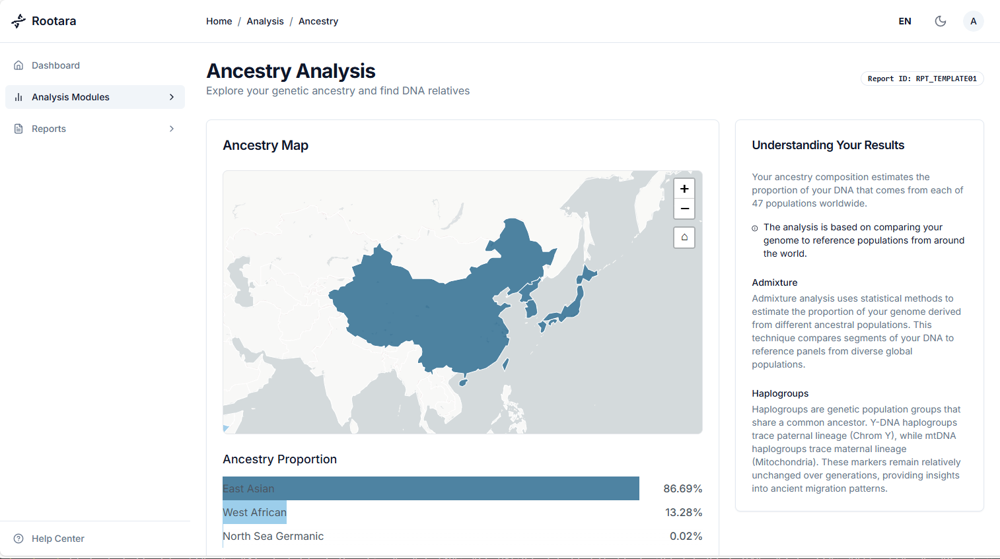

<div align="center">
  

  <h1>Rootara - 开源基因平台</h1>

  <p><strong><a href="README.md">English</a> | 中文</strong></p>
</div>

## 介绍

Rootara 是一个易于部署的消费级基因数据托管平台，用户可自部署在自己的服务器中，确保数据安全。Rootara 支持导入23andMe、WeGene等检测服务商的个人基因数据。通过使用Docker Compose进行快速安装和配置，用户可以在本地环境中安全地执行祖源分析、遗传特征解析以及ClinVar数据库查询等多种操作。

## ⚠️ 重要提醒

**当前系统处于测试状态，所有遗传特征分析结果均为随机生成的测试数据，不具有任何科学依据或参考价值。请勿将测试结果用于任何医学、健康或其他重要决策。**

## 特性

### ✨ 核心功能
- 🧬 **多源兼容**：支持23andMe、WeGene等多种基因检测服务商的数据文件
- 📊 **全面分析**：
  - 祖先起源探索与交互式可视化
  - 遗传特征评估
  - 单体型群分析（父系和母系）
  - ClinVar变异解读
- 🔒 **隐私保护**：所有处理都在本地完成，确保您的个人信息不被泄露

### 🚀 性能与可靠性
- ⚡ **高性能**：Redis缓存提升API响应速度70-90%（标准版本）
- 🔗 **连接池管理**：数据库连接复用，资源利用率提升80%
- 📝 **结构化日志**：完善的日志系统，便于问题诊断
- 💊 **健康监控**：实时监控系统状态和性能指标

### 🛡️ 安全特性
- 🔐 **JWT认证**：安全的用户认证机制
- 👤 **非root容器**：Docker容器使用非特权用户运行
- 🔑 **API密钥保护**：前后端通信加密
- 📊 **资源监控**：CPU、内存、磁盘使用率监控和告警

## 快速开始

### 选择部署版本

根据您的服务器配置选择合适的部署版本：

#### 📁 标准版本（推荐）
```bash
# 下载配置文件
cd rootara/docker
# 启动服务
docker-compose -f docker-compose.standard.yml up -d
```

**特性：**
- 内存占用：约70-80MB
- 性能：含Redis缓存，API响应速度提升70-90%
- 适用：生产环境，内存充足的服务器（>1GB）

#### 📁 轻量版本
```bash
# 下载配置文件
cd rootara/docker
# 启动服务
docker-compose -f docker-compose.lite.yml up -d
```

**特性：**
- 内存占用：约30-40MB（节省50MB）
- 性能：内存缓存，响应稍慢但够用

### 系统要求

#### 最低要求
- **CPU**: 1核心
- **内存**:
  - 标准版本：1GB RAM
  - 轻量版本：512MB RAM
- **存储**: 2GB 可用空间
- **软件**: Docker 20.0+, Docker Compose 2.0+

#### 推荐配置
- **CPU**: 2核心或以上
- **内存**: 2GB RAM 或以上
- **存储**: 10GB 可用空间（用于数据存储）

### 访问系统

部署完成后，访问 http://localhost:3000

**默认管理员账户：**
- 邮箱：admin@rootara.app
- 密码：rootara123

> 💡 **重要提示**：管理员密码只能通过修改 docker-compose.yml 文件中的 `ADMIN_PASSWORD` 环境变量并重启容器来更改，无法在应用程序内部修改。

### 配置说明

#### 必须修改的配置

在选择的 `docker-compose.yml` 文件中，建议修改以下配置：

```yaml
environment:
  # 🔧 管理员账号配置 - 建议修改
  - ADMIN_EMAIL=your-email@example.com          # 管理员邮箱
  - ADMIN_PASSWORD=your-secure-password         # 管理员密码

  # 🔧 安全配置 - 建议修改
  - JWT_SECRET=your-random-secret-string        # JWT密钥
  - ROOTARA_BACKEND_API_KEY=your-api-key        # API密钥（前后端需一致）
```

#### 可选配置

```yaml
ports:
  - "3000:3000"  # 🔧 可修改端口：如改为8080:3000

# Redis内存调整（仅标准版本）
command: redis-server --appendonly yes --maxmemory 512mb --maxmemory-policy allkeys-lru
```

## 使用指南

### 数据上传

1. 登录系统后，点击"上传数据"
2. 支持的文件格式：
   - 23andMe 原始数据文件（.txt）
   - WeGene 原始数据文件（.txt）

### 分析功能

- **祖源分析**：查看您的祖先地理分布



- **单倍群分析**：父系和母系单倍群分析
- **遗传特征**：了解基因对个人特征的影响
- **健康风险**：基于ClinVar数据库的变异解读


## 🛠️ 常用命令

### 服务管理
```bash
# 启动服务
docker-compose -f docker-compose.standard.yml up -d

# 停止服务
docker-compose -f docker-compose.standard.yml down

# 查看日志
docker-compose -f docker-compose.standard.yml logs -f

# 重启服务
docker-compose -f docker-compose.standard.yml restart

# 查看服务状态
docker-compose -f docker-compose.standard.yml ps
```

### 数据管理
```bash
# 备份数据
cp -r ./data ./data-backup-$(date +%Y%m%d)

# 查看日志文件
tail -f ./logs/rootara.log
```

## 📊 监控端点

系统提供多个监控端点用于状态检查：

- `GET /health` - 综合健康检查（包含系统指标）
- `GET /health/live` - 存活性检查
- `GET /health/ready` - 就绪性检查
- `GET /metrics` - 性能指标（需要API密钥）

## 🔧 故障排除

### 常见问题

1. **容器启动失败**
   ```bash
   # 查看详细错误信息
   docker-compose logs backend
   ```

2. **无法访问网页**
   - 检查端口是否被占用：`netstat -an | grep 3000`
   - 确认防火墙设置允许相应端口

3. **内存不足**
   - 切换到轻量版本：使用 `docker-compose.lite.yml`
   - 调整Redis内存限制（标准版本）

4. **性能优化**
   - 标准版本：调整Redis最大内存
   - 轻量版本：考虑升级到标准版本

## 🏗️ 系统架构

### 技术栈
- **前端**: Next.js 15.5.4, React 18.3.1, TypeScript, Tailwind CSS
- **后端**: FastAPI, Python 3.13, SQLite
- **缓存**: Redis 7.4（标准版本）
- **容器**: Docker, Docker Compose

### 服务架构
```
用户浏览器 → 前端 (Next.js) → 后端 (FastAPI) → SQLite数据库
                                  ↓
                           Redis缓存（可选）
```

## 贡献

欢迎任何形式的特征贡献，核对后会加入到Rootara默认特征中。

## 许可证

本项目采用AGPLv3许可证发布。请参阅 [LICENSE](LICENSE) 文件获取更多信息。

